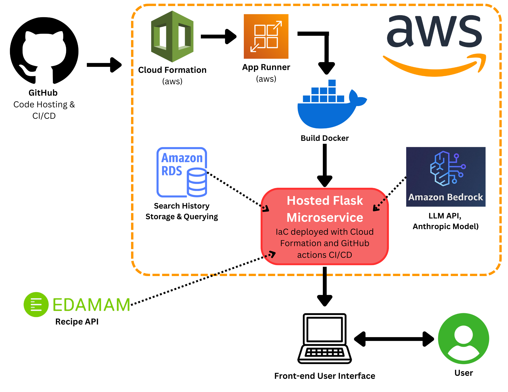
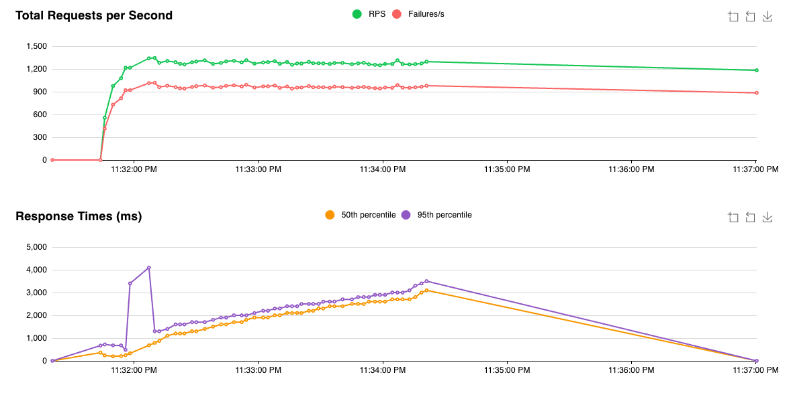
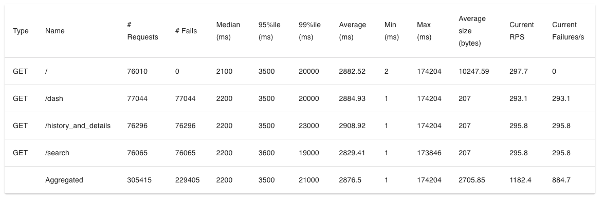

# IDS 706 Final Project: Recipe Generator 🛒🍎🧀🥦🥖
Lilah DuBoff, Leonard Eshun, Kayla Haeussler, Uzoma Uwazurike, Jenny Wu  
[Demo Video](https://www.youtube.com/)  


## Project Overview
Our project is a recipe suggestion tool designed to help users make the most of the ingredients they already have in their kitchen.  Users can select ingredients they may have in their kitchen and our tool will suggest recipes to them that they could make with said ingredients. Our tool provides recipe details, as well as recipe history, giving the user not only the instructions to make a meal without having to run to the grocery store, but also fun facts about the meal to share around the dinner table. In addition to these search features, our tool includes summary search analytics, showcasing summary statistics of searches made by all users. 

## Project Architecture
 

- **Microservice:** Python was used to build a microservice via Docker and AWS CloudFormation and App Runner.
- **Data Engineering:** SQL queries were performed within AmazonRDS. AmazonRDS stored search data history from our site, which we were then able to query using SQL for the summary statistics page of our site. 
- **Infastructure as Code (IaC):** AWS CloudFormation was the IaC solution utilized by our team for infastructure setup and management.
- **API Usage:** This project utilizes the Edamam recipe API, which supplied the recipe details and images based on the user selected ingredients. The Amazon Bedrock LLM API was used to return history of the recipe selected by the user. 
  
## Load Test & Quantitative Assessment
Load testing of our application was conducted using the ```Locust``` package. We were interested in seeing the performance of our tool under varying levels of user demand, with specific interest in the ability to handle 10,000 requests per second. Our testing yielded the following results:  

**Performance Charts:**

**Performance Statistics:**


Our team believes the shortcomings in the load handling of our application stem from it interfacing with two APIs as well as a database. In addition, due to financial constraints, we are using the free tier versions of Amazon Bedrock and RDS, and lowest paid tier of the Edamam API. If our team was to invest in higher tier versions of these services, speed would improve drastically. The high amount of failures seen is likely due to timeouts caused by the Edamam API, which at our price tier throttles calls to 10 calls per minute.  

## How to Run This Project

## AI Pair Programming
how AI Pair Programming tools (Github Copilot and one more tool of your choice) were used in your development process.
Github Copilot chat GPT for html databricks assistant to ensure things are running correctly
While working on this project our team utilized tools such as GitHub Copilot, ChatGPT and DataBricks Assistant to ensure effective development and deployment. Our frontend team utilized ChatGPT to improve aesthetics of our html site. The backend team utilized Copilot and DB Assistant to ensure that the different aspects of our projects were interfacing together correctly 

## Possible Improvements
Our team considered the possible areas for improvement given additional time, resources and specialized expertise:

- Increase aesthetics and UI of our site, this was our team's first time writing html code
- Purchasing higher tier access of APIs in order to increase efficiency and decrease wait times

