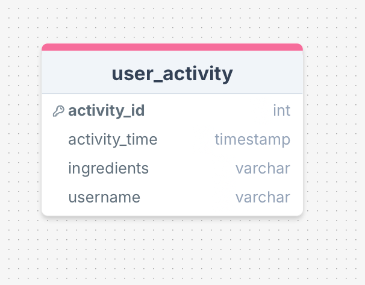
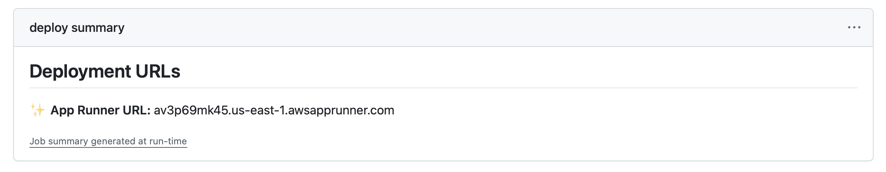

# IDS 706 Final Project: Recipe Generator 🛒🍎🧀🥦🥖
Lilah DuBoff, Leonard Eshun, Kayla Haeussler, Uzoma Uwazurike, Jenny Wu  

[](https://github.com/siliconshells/DE_FinalProject_KEH/actions/workflows/format.yml)
[](https://github.com/siliconshells/DE_FinalProject_KEH/actions/workflows/install.yml)
[](https://github.com/siliconshells/DE_FinalProject_KEH/actions/workflows/lint.yml)
[](https://github.com/siliconshells/DE_FinalProject_KEH/actions/workflows/test.yml)  
[](https://github.com/siliconshells/DE_FinalProject_KEH/actions/workflows/deploy-cloudformation.yml)
## Project Overview  
[Click Here to Check Out our Application](https://vhksckmmxw.us-east-1.awsapprunner.com/) 
[Clich Here for our Demo Video](https://www.youtube.com/watch?v=iQguMlUBems)  
Our project is a recipe suggestion tool designed to help users make the most of the ingredients they already have in their kitchen. Users can select ingredients they may have in their kitchen and our tool will suggest recipes to them that they could make with said ingredients. Our tool provides recipe details, as well as the history of the ingredients inputted, giving the user not only the instructions to make a meal without having to run to the grocery store, but also fun facts about the meal to share around the dinner table. In addition to these search features, our tool includes summary search analytics, showcasing summary statistics of searches made by all users to provide interesting queries of what other chefs are cooking with. 

## Project Architecture
 

- **Microservice:** Python was used to build a microservice via Docker and AWS CloudFormation and App Runner.
- **Data Engineering:** SQL queries were performed within AmazonRDS. AmazonRDS stored search data history from our site, which we were then able to query using SQL for the summary statistics page of our site. 
- **Infastructure as Code (IaC):** AWS CloudFormation was the IaC solution utilized by our team for infastructure setup and management.
- **API Usage:** This project utilizes the Edamam recipe API, which supplied the recipe details and images based on the user selected ingredients. The Amazon Bedrock LLM API was used to return history of the recipe selected by the user. 
  
## Load Test & Quantitative Assessment
Load testing of our application was conducted using the ```Locust``` package. We were interested in seeing the performance of our tool under varying levels of user demand, with specific interest in the ability to handle 10,000 requests per second. Our testing yielded the following results:  

**Performance Charts:**

**Performance Statistics:**


Our team believes the shortcomings in the load handling of our application stem from it interfacing with two APIs as well as a database. In addition, due to financial constraints, we are using the free tier versions of Amazon Bedrock and RDS, and lowest paid tier of the Edamam API. If our team was to invest in higher tier versions of these services, speed would improve drastically. The high amount of failures seen is likely due to timeouts caused by the Edamam API, which at our price tier throttles calls to 10 calls per minute.  

## How to Run This Project
---
noteId: "21467960b90011ef9b4b3150dae35552"
tags: []

---

Deployment Instructions:   
1. Prerequisites:   
	- Create an AWS Account   

2. Create and AWS IAM User for deployement.   
    - A name like "user_for_github_push"   
    - Under Permissions, give user these permissions:
        - AmazonBedrockFullAccess
        - AmazonRDSFullAccess
        - AWSAppRunnerFullAccess
        - AWSCloudFormationFullAccess
        - IAMFullAccess
        - SecretsManagerReadWrite

    - Under Security credentials, _create access key_. Copy the AWS_ACCESS_KEY_ID and the AWS_SECRET_ACCESS_KEY. You'll use them later.

3. Create a Github Connection to your Github repository.
    - This gives AWS the ability to communicate with your repository. It also installs AWS Cloudformation required files. Copy the arn and save it in your Github repository secrets as **REPOSITORY_CONNECTION_ARN**.

4. Setup and RDS database with Postgresql.
    - Setup an RDS with Postgres and create a table with this structure:
    

5. Setup an account at Edamam. This is the API we use for generating the recipes. You'll need the API keys later.

6. Create one AWS Secrets Manager "Secrets" and fill in these secrets:
    - DB_HOST
    - DB_USER
    - DB_PASSWORD
    - EDAMAM_APP_ID
    - EDAMAM_APP_KEY
    - EDAMAM_API_URL
    - AWS_ACCESS_KEY_ID
    - AWS_SECRET_ACCESS_KEY
    - BEDROCK_MODEL_ID

7. Do this on your computer:
	- Install Docker locally

8. Clone Repository:
    git clone <repository_url>
    cd <local_repository_directory>

9. At Github Secrets and variable, setup these secret:
    - REPOSITORY_CONNECTION_ARN
    - AWS_SECRET_ACCESS_KEY
    - AWS_ACCESS_KEY_ID

10. Continuous Deployment via Cloud Formation:
    Git Add, Commit and Push any change to repository:
        At this point you can make a change, add, commit and push to Github. Github Actions will take over and deploy the application to AWS using Cloud Formation for Infrastructure as Code and App Runner to dockerize the application and deploy on AWS. It will give it a public URL which can be retrieved as described above.

11. Get the URL
    1. Look for the last set of workflow runs and click the one with name: _Deploy CloudFormation Stack_
    1. Click on it and find the current URL under **Deployment URLs**
        

12. To redeploy
    1. Delete App Runner in the console first
    1. Delete Stack in the console second
    1. Just push a change or execute an existing Github Action  

    Alternatively, you can just push again but the stack will not be updated as the workflow checks if it exists and skip its creation.

13. Use CloudShell
    Use cloudshell to see how Cloudformation is working and it's especially useful when you get errors. One useful command is:
    aws cloudformation describe-stack-events --stack-name my-flask-app-stack
## AI Pair Programming
While working on this project our team utilized tools such as GitHub Copilot, ChatGPT and DataBricks Assistant to ensure effective development and deployment. Our frontend team utilized ChatGPT to improve aesthetics of our html site. The backend team utilized Copilot and DB Assistant to ensure that the different aspects of our projects were interfacing together correctly 

## Possible Improvements
Our team considered the possible areas for improvement given additional time, resources and specialized expertise:

- Increase aesthetics and UI of our site, this was our team's first time writing html code
- Add real-time feedback, like loading spinners, for API calls and loading on the site
- Purchasing higher tier access of APIs in order to increase efficiency and decrease wait times

