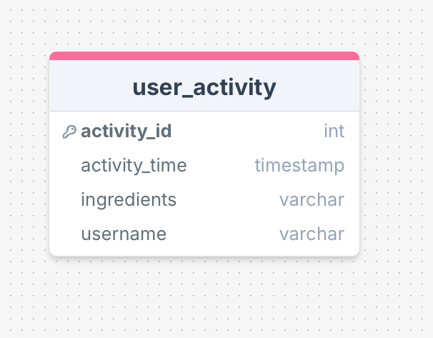
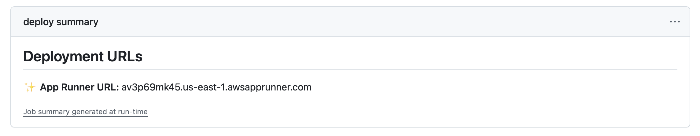

Deployment Instructions:   
1. Prerequisites:   
	- Create an AWS Account   

2. Create and AWS IAM User for deployement.   
    - A name like "user_for_github_push"   
    - Under Permissions, give user these permissions:
        - AmazonBedrockFullAccess
        - AmazonRDSFullAccess
        - AWSAppRunnerFullAccess
        - AWSCloudFormationFullAccess
        - IAMFullAccess
        - SecretsManagerReadWrite

    - Under Security credentials, _create access key_. Copy the AWS_ACCESS_KEY_ID and the AWS_SECRET_ACCESS_KEY. You'll use them later.

3. Create a Github Connection to your Github repository.
    - This gives AWS the ability to communicate with your repository. It also installs AWS Cloudformation required files. Copy the arn and save it in your Github repository secrets as **REPOSITORY_CONNECTION_ARN**.

4. Setup and RDS database with Postgresql.
    - Setup an RDS with Postgres and create a table with this structure:
    

5. Create one AWS Secrets Manager "Secrets" and fill in these secrets:
    - DB_HOST
    - DB_USER
    - DB_PASSWORD
    - EDAMAM_APP_ID
    - EDAMAM_APP_KEY
    - EDAMAM_API_URL
    - AWS_ACCESS_KEY_ID
    - AWS_SECRET_ACCESS_KEY
    - BEDROCK_MODEL_ID

6. Do this on your computer:
	- Install Docker locally

3. Clone Repository:
    git clone <repository_url>
    cd <local_repository_directory>

4. At Github Secrets and variable, setup these secret:
    - REPOSITORY_CONNECTION_ARN
    - AWS_SECRET_ACCESS_KEY
    - AWS_ACCESS_KEY_ID

5. Continuous Deployment via Cloud Formation:
    Git Add, Commit and Push any change to repository:
        At this point you can make a change, add, commit and push to Github. Github Actions will take over and deploy the application to AWS using Cloud Formation for Infrastructure as Code and App Runner to dockerize the application and deploy on AWS. It will give it a public URL which can be retrieved as described above.

6. Get the URL
    1. Look for the last set of workflow runs and click the one with name: _Deploy CloudFormation Stack_
    1. Click on it and find the current URL under **Deployment URLs**
        

8. To redeploy
    1. Delete App Runner in the console first
    1. Delete Stack in the console second
    1. Just push a change or execute an existing Github Action  

    Alternatively, you can just push again but the stack will not be updated as the workflow checks if it exists and skip its creation.